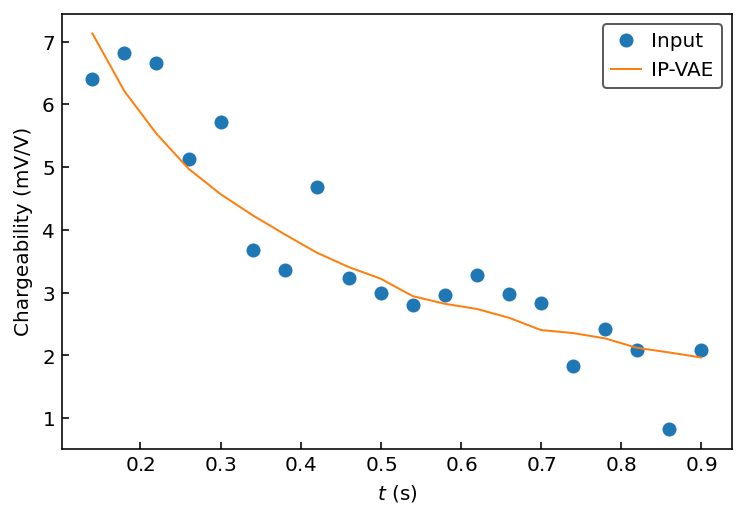

# IP-VAE
PyTorch implementation of the time-domain induced polarization variational autoencoder.

Original paper:

## Setup

### Dependencies
- [PyTorch](https://pytorch.org/)
- [NumPy](https://numpy.org/)
- [matplotlib](https://matplotlib.org/) (optional)

### Installation
```console
python setup.py install
```

## Usage

### Loading the model
```python
import torch
import numpy as np
import matplotlib.pyplot as plt
from ipvae import IPVAE

model = IPVAE()
model.load_weights()
```

### Generative properties
```python
# Generate a synthetic decay
x = model.module.decode(torch.rand(2))
# Add synthetic noise to it
xn = x + 5*(torch.rand(20) - 0.5)
```

### Basic denoising
```python
# Denoise decay with a forward pass
xp = model.forward(xn)

# Plot comparison
t = np.arange(0.12+0.02, 0.92, 0.04)  # the IRIS ELREC Pro windows
plt.plot(t, x.detach().numpy(), '--k', label="Ground truth")
plt.plot(t, xn.detach().numpy(), '.k', label="Noisy input")
plt.plot(t, xp[0].detach().numpy(), '-C3', label="Denoised")
plt.legend()
plt.ylabel("Chargeability (mV/V)")
plt.xlabel("$t$ (s)")
```

<p align="center">
  
</p>

### Uncertainty estimation
```python
# Run 100 realizations and stack as a tensor
xp = [model.forward(xn)[0] for _ in range(100)]
xp = torch.stack(xp)
# Compute statistics
xp_avg = torch.mean(xp, dim=0)
xp_std = torch.std(xp, dim=0)
```
