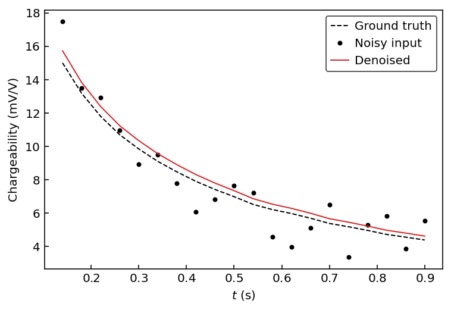

# IP-VAE
PyTorch implementation of the time-domain induced polarization variational autoencoder.

Original paper:

## Setup

### Dependencies
- [PyTorch](https://pytorch.org/)
- [NumPy](https://numpy.org/)
- [matplotlib](https://matplotlib.org/) (optional)

### Installation
```console
python setup.py install
```

## Usage

```python
import torch
import numpy as np
import matplotlib.pyplot as plt
from ipvae import IPVAE

model = IPVAE()
model.load_weights()

# Generate a synthetic decay
x = model.module.decode(torch.rand(2))
# Add synthetic noise to it
x += 5*(torch.rand(20) - 0.5)

# Denoise decay with a forward pass
xp = model.forward(x)

# Plot comparison
t = np.arange(0.12+0.02, 0.92, 0.04)  # the IRIS ELREC Pro windows
plt.plot(t, x.numpy(), 'o', label="Input")  # model input
plt.plot(t, xp[0].detach().numpy(), label="IP-VAE")  # model output
plt.legend()
plt.ylabel("Chargeability (mV/V)")
plt.xlabel("$t$ (s)")
```

<p align="center">
  
</p>
