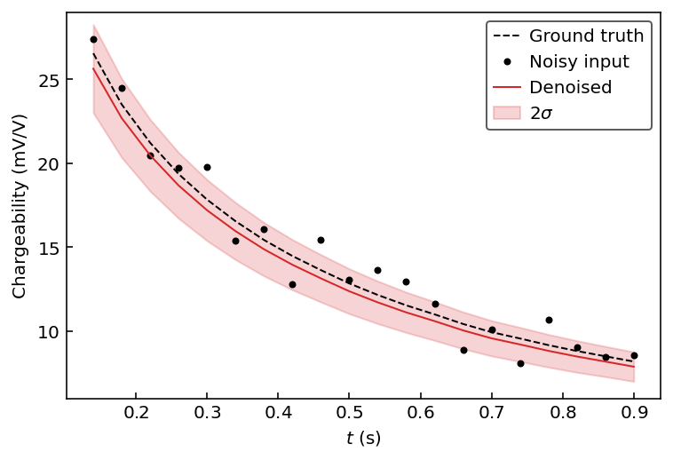

[](https://zenodo.org/badge/latestdoi/389770922)


# IP-VAE
PyTorch implementation of the time-domain induced polarization variational autoencoder.

Original paper:

## Setup

### Dependencies
- [PyTorch](https://pytorch.org/)
- [NumPy](https://numpy.org/)
- [matplotlib](https://matplotlib.org/) (optional)

### Installation
```console
python setup.py install
```

## Usage

### Loading the model
```python
import ipvae
import torch
import numpy as np
import matplotlib.pyplot as plt

model = ipvae.Net()
model.load_weights()
```

### Generative properties
```python
# Generate a synthetic decay
# by decoding a sample of 2D N(0,1)
x = model.decode(torch.randn(2))

# Add uniform random noise to it
xn = x + 5*(torch.rand(20) - 0.5)
```

### Basic denoising
In this example we show how to denoise a decay curve. IP-VAE forward passes are stochastic. Doing a single pass will provide varying results.
```python
# Denoise decay with a forward pass
output = model.forward(xn)  # returns (xp, mu, logvar)
xp = output[0]

# Plot comparison
t = np.arange(0.14, 0.92, 0.04)  # the IRIS ELREC Pro time windows
plt.plot(t, x.detach().numpy(), '--k', label="Ground truth")
plt.plot(t, xn.detach().numpy(), '.k', label="Noisy input")
plt.plot(t, xp.detach().numpy(), '-C3', label="Denoised")
plt.legend()
plt.ylabel("Chargeability (mV/V)")
plt.xlabel("$t$ (s)")
plt.show()
```

<p align="center">
  
</p>

### Uncertainty estimation
It is a better idea to run multiple realizations to estimate data uncertainty. Here we use `2*sigma` as the uncertainty but users are free to compute any quantiles.

```python
# Run 100 realizations and stack as a tensor
xp = [model.forward(xn)[0] for _ in range(100)]
xp = torch.stack(xp)
# Compute statistics
xp_avg = torch.mean(xp, dim=0)
xp_std = torch.std(xp, dim=0)

# Plot comparison
plt.figure()
plt.plot(t, x.detach().numpy(), '--k', label="Ground truth")
plt.plot(t, xn.detach().numpy(), '.k', label="Noisy input")
plt.plot(t, xp_avg.detach().numpy(), '-C3', label="Denoised")
plt.fill_between(t,
                 (xp_avg-2*xp_std).detach().numpy(),
                 (xp_avg+2*xp_std).detach().numpy(),
                 color='C3', alpha=0.2, label=r"$2\sigma$")
plt.legend()
plt.ylabel("Chargeability (mV/V)")
plt.xlabel("$t$ (s)")
plt.show()
```

<p align="center">
  
</p>

### Computation speed
The IP-VAE is quite fast. These are timing results from running a forward pass on a Apple M1 chip.
```python
%timeit model.forward(xn)
```
```console
135 µs ± 619 ns per loop (mean ± std. dev. of 7 runs, 10000 loops each)
```
Meaning it can process around 7500 decays per second on a personal laptop computer.
